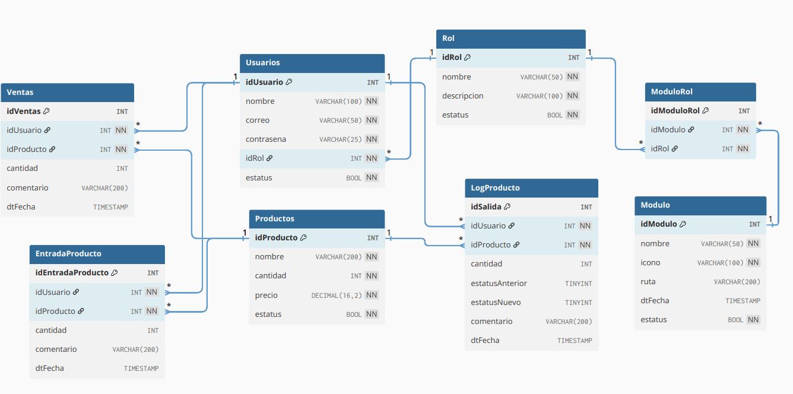

# EvaluacionTecnicaCastores  
Evaluación técnica para el área de TI

---

## 📂 Estructura del Repositorio

- [📁 Frontend](./frontend): Proyecto Angular 19 que contiene la interfaz de usuario.
- [📁 Backend](./backend): Proyecto Spring Boot con Java 21/Maven que expone la API REST.
- [📁 Scripts](./scripts): Contiene scripts SQL utilizados en la base de datos (MySQL 8).
- [📄 CONOCIMIENTOS SQL.md](./CONOCIMIENTOS%20SQL.md): Documento teórico correspondiente a la parte de conocimientos en SQL.

🎥 [Ver video con la funcionalidad del aplicativo](https://drive.google.com/file/d/1QnC2Xs18Y9vQ_AG-BsWdb9Gaoy1VoXQw/view?usp=sharing)  

📊 [Ver Diagrama Relacional de la Base de Datos](./scripts/diagrama_relacional.png)



---

## 🧰 Entorno de Desarrollo
### IDE utilizado
- Backend: IntelliJ IDEA (o cualquier IDE compatible con Java/Spring Boot)
- Frontend: Visual Studio Code (o cualquier IDE compatible con Angular)

### Versión del lenguaje de programación utilizado
- Backend: Java 21 con Spring Boot y Maven
- Frontend: Angular 19

### DBMS utilizado y su versión
- MySQL versión 8+

---

## 🚀 Pasos para correr la aplicación

### 1️⃣ Clonar o descargar el repositorio

El proyecto está dividido en dos carpetas:

- `/backend`: contiene el código del servidor (API REST)
- `/frontend`: contiene el código de la interfaz web (Angular)

---

### 2️⃣ Backend (Spring Boot con Maven)

#### a. Descargar dependencias

```bash
cd backend
mvn clean install
```
#### b. Configurar archivo application.properties
Ubicado en src/main/resources/application.properties, asegúrate de configurar tus credenciales de base de datos. Si estás usando una base de datos limpia, puedes usar el siguiente ejemplo:
```properties
# Base de datos
spring.datasource.url=jdbc:mysql://localhost:3306/mi_base_de_datos?useSSL=false&serverTimezone=UTC
spring.datasource.username=TU_USUARIO
spring.datasource.password=TU_CONTRASEÑA

# JPA / Hibernate
spring.jpa.database=mysql
spring.jpa.show-sql=true
spring.jpa.generate-ddl=true
spring.jpa.hibernate.ddl-auto=validate
spring.jpa.properties.hibernate.dialect=org.hibernate.dialect.MySQL8Dialect

# JWT Config
jwt.secret=Kf/tfMH9PQB8zvBhbnc3z6pyUj3ZELZbdXwL0rEx5MI=
jwt.accessExpiration=3600000
jwt.refreshExpiration=86400000
jwt.issuer=http://localhost:4200
jwt.audience=http://localhost:8080
```

#### c. Ejecutar Script SQL
Ejecuta el script de base de datos que se encuentra en la carpeta: [SCRIPTS/Punto 2.sql](./SCRIPTS/Punto 2.sql). 
Este script crea las tablas necesarias en MySQL.

#### d. Ejecutar la Aplicación
Desde la raíz del proyecto backend, ejecuta:
```bash
mvn spring-boot:run
```
🔥 Por defecto, el backend corre en el puerto: `http://localhost:8080`


### 🌐 3. Configuración del Frontend
#### a. Descargar dependencias
Dentro de la carpeta frontend, ejecuta:
```bash
npm install
```

#### b. Crear archivo `.env`
Crea un archivo .env en la raíz del proyecto frontend en caso de no existir. Una vez que existee el archivo agregar la siguiente variable:
```ts
apiURL: 'http://localhost:8080/'
```

#### c. Ejecutar la Aplicación
Desde la carpeta frontend, ejecuta:
```bash
ng serve
```
🔥 Por defecto, el frontend see ejecutará en el puerto: `http://localhost:4200`
